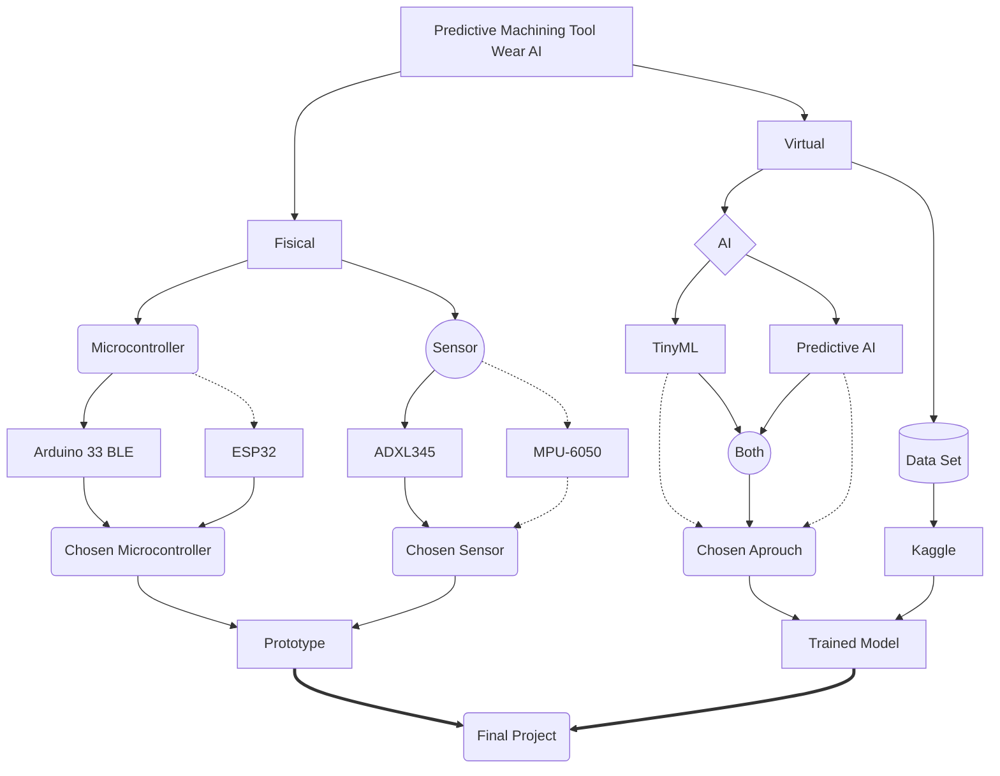

```mermaid
%% Diagrama de Fluxo
graph TD
    A[Predictive Machining Tool Wear AI] --> B[Fisical]
    A --> C[Virtual]
    B --> D(Microcontroller)
    D --> H[Arduino 33 BLE] --> N
    D -.-> I[ESP32] --> N(Chosen Microcontroller) --> P
    B --> E((Sensor))
    E --> J[ADXL345] --> O
    E -.-> K[MPU-6050] -.-> O(Chosen Sensor)
    O --> P[Prototype] ==> S
    C --> F{AI}
    F --> L[TinyML] -.-> Q(Chosen Aprouch) --> R
    L --> T((Both)) --> Q
    M --> T
    F --> M[Predictive AI] -.-> Q
    C --> G[(Data Set)] 
    G --> Z[Kaggle] --> R[Trained Model]
    R ==> S(Final Project)
```