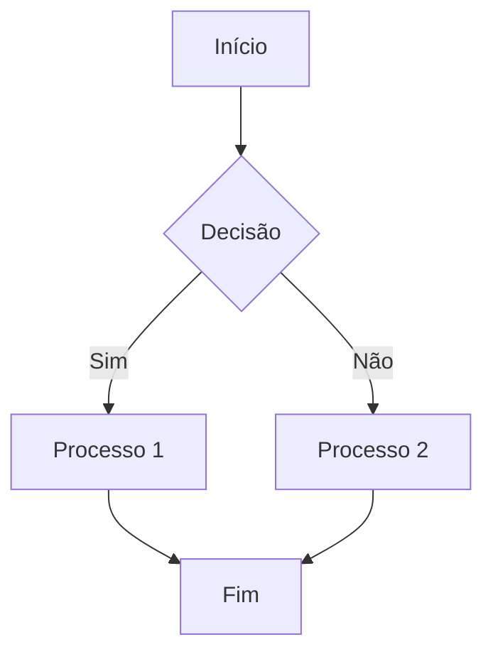
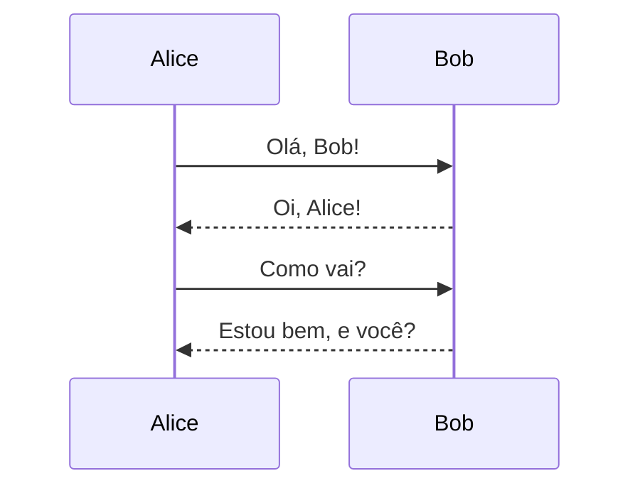
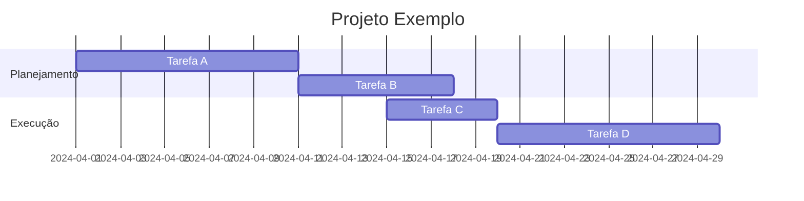
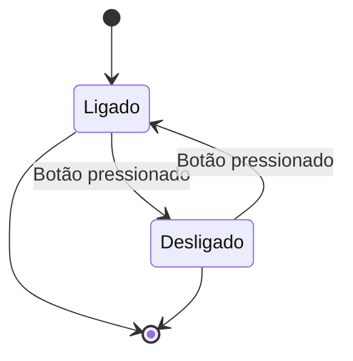
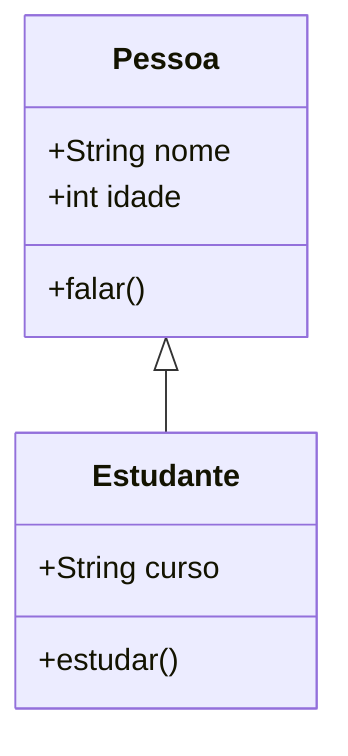
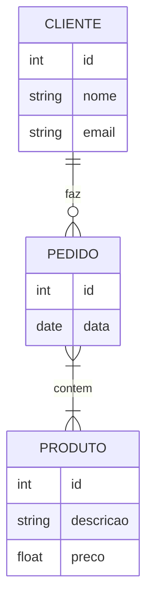
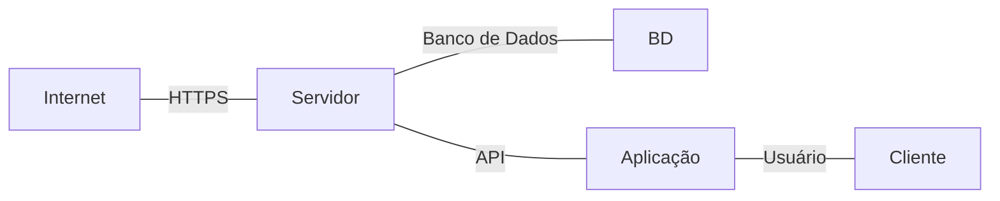

```mermaid
%% Diagrama de Fluxo
graph TD
    A[Início] --> B{Decisão}
    B -->|Sim| C[Processo 1]
    B -->|Não| D[Processo 2]
    C --> E[Fim]
    D --> E[Fim]
```

```mermaid
%% Diagrama de Sequência
sequenceDiagram
    participant Alice
    participant Bob
    Alice->>Bob: Olá, Bob!
    Bob-->>Alice: Oi, Alice!
    Alice->>Bob: Como vai?
    Bob-->>Alice: Estou bem, e você?
```

```mermaid
%% Diagrama de Gantt
gantt
title Projeto Exemplo
    section Planejamento
    Tarefa A :a1, 2024-04-01, 10d
    Tarefa B :after a1, 7d
    section Execução
    Tarefa C :2024-04-15, 5d
    Tarefa D :2024-04-20, 10d
```

```mermaid
%% Diagrama de Estados
stateDiagram-v2
    [*] --> Ligado
    Ligado --> Desligado : Botão pressionado
    Desligado --> Ligado : Botão pressionado
    Ligado --> [*]
    Desligado --> [*]
```

```mermaid
%% Diagrama de Classes UML
classDiagram
    class Pessoa {
        +String nome
        +int idade
        +falar()
    }
    class Estudante {
        +String curso
        +estudar()
    }
    Pessoa <|-- Estudante
```

```mermaid
%% Diagrama de Entidade-Relacionamento
erDiagram
    CLIENTE ||--o{ PEDIDO : faz
    PEDIDO }|--|{ PRODUTO : contem
    CLIENTE {
        int id
        string nome
        string email
    }
    PEDIDO {
        int id
        date data
    }
    PRODUTO {
        int id
        string descricao
        float preco
    }
```

```mermaid
%% Diagrama de Rede
graph LR
    Internet ---|HTTPS| Servidor
    Servidor ---|Banco de Dados| BD
    Servidor ---|API| Aplicação
    Aplicação ---|Usuário| Cliente
```
